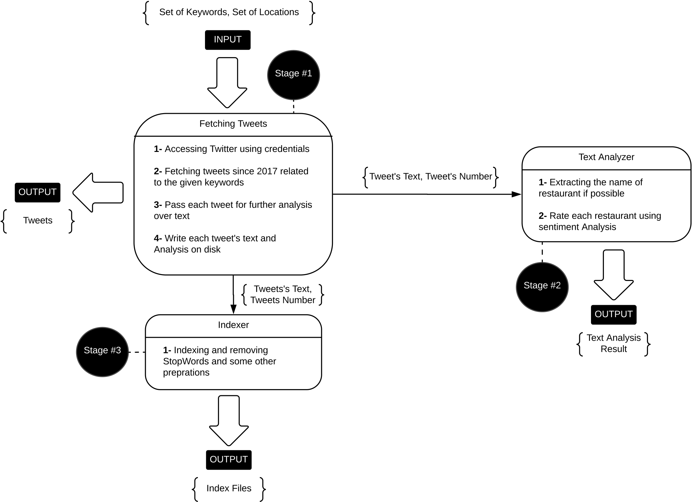

# IR-Twitter-Crawler
Student and Project General Information:
  - Course: Information Retrieval
  - Professor: Prof. Mohsen Kahani
  - Student Name: Navid Alipour
  - Student Number: 9312430379
  - Selected Project Number: 2

## Project Description:
This is a crawler project which crawls the twitter and searches for the restaurant's among tweets.
It also rates each restaurant in sense of Stars using NLP analysis.

### Technologies Used:
  - Java 1.8
  - Lucene v6.6.1, for indexing
  - Twitter4j 4, for fetching tweets and querying twitter
  - Stanford NLP 3.9, for `Sentiment Analysis`, `POS Tagging`, `Named Entity` analysis
  - Maven, for package management

  
### How to Run:
  - For indexing run the `Indexer` Class, `NOTE`: please make sure there are tweets in the 'tweets' folder
  
  - For analyzing and fetching the tweets run the `App` Class, `NOTE`: make sure to put proper credentials in `ProjectConstants` Class.
  
  - For more configuration please check the `ProjectConstant` Class.
  
  - `NOTE`: I know it is not appropriate to store constants and configuration settings in a class but due to lack of time ... I did!
  
### Problems I Encounter in this Project:
  - Most of the tweets we fetched were not related to a specific restaurant.
  - I could'nt find any solution to extract menu items from tweets.
  - My proposed heuristic to identify restaurant's name from tweets might result in a good `Precision` but it lacks a proper `Recall` factor.
  - I should have run the process of text processing on multiple threaded to enhance the performance but due to lack of time I simply could'nt.
  
### System Architecture:


#### Stage Number 1:
As mentioned in this stage system fetch related tweets since `2017-01-01` based on the keywords which are set in `ProjectConstant` class such as `restuarant` from some specific location which again are set in `ProjectConstant` class such `chicago`. 

After that system passes the tweets for further analysis and indexing, besides writing each tweet's text on disk to save them. it also saves the tweets in `tweets` directory.
 
#### Stage Number 2:
At `Stage #2` system uses `Stanford NLP` library and run some text analysis, such as `Named Entity Recognition`, `Part of Speech Tagging`, and `Sentiment Analysis`.

System uses a heuristic approach to extract the name of restaurant from tweets. System check's if a `Token` is `Noun` (using `POS`) and `LOCATION`(using `NER`) then it is probably a restaurant(since all tweets are about restaurant cause it queried for restaurant related tweets).

After finding restaurants system analyzes the text of each tweet to determine the ratings of each restaurant using sentiment analysis.

Finally at this stage system stores the results in a text file named `RestaurantsList.txt` in `finalOutputList` directory.
 
#### Stage Number 3:
At this level system index each tweet's text, and also some other information such as `Created Date`. after that system saves the index files in `indexes` folder. so that it would be easy to search for restaurant's if it was needed.

System uses `EnglishAnalyzer` for indexing which handles `Stop Word Removal`, `Lemmatization`, and `Stemming`.

To search the created indexes use `QueryParser` and `IndexSearcher` class from the `Lucene` packages.

### NOTE:
I excluded some cities from `Citis` list so that the program would terminate much sooner... uncomment the `FIXME` section for doing complete analysis.


I also excluded some fetched tweets from the final project package to reduce the size of the project and the final zip file. 

### Sample Result:
Tweets (`Stage #1` output):
```
chicago|Mon Jul 09 22:20:35 IRDT 2018
@Parker Molloy
Okay, which of my musician friends wants to write the Trump administration version of uncomfortable restaurant "Happy Birthday"? https://t.co/20go0LpteB
```

Found Restaurants List (`Stage #2` output):

```json
    {
    	"name":  "Vero International Cuisine",
    	"city":  "Racine",
    	"rating": "**",
    	"tweet-id": "119"
    }
```

### Detailed Description of Each Used Technologies:
  - Lucene: `Apache Lucene` is an open-source high performance search engine library written in Java and it is distributed by `Apache Foundation`, used for full-text search and indexing.
  
  - Stanford NLP: 'Stanford NLP' API is an open-source library developed by the `Stanford NLP Group`, it provides a wide set of `Natural Language Processing` tools and it is written in Java.
   Some of the analysis it can perform are: `Named Entity Recognition`, `Part of Speech Tagging`, `Sentiment Analysis`, `Summariaztion` and etc.
   it is available for 6 different languages such as `English`, `Chineese`, `French` and etc.
   
   - Twitter4j: `Twitter4j` is an open-source unofficial Java library for `Twitter` API, which makes it quite easy to integrate with `Twitter` applications.
      
   - Maven: `Apache Maven` is a dependency management and build automation tool for Java projects.
        

### Author : 
 **Navid Alipour** - *Simple Twitter Restaurant Crawler* - [Navid Alipour](https://github.com/navid9675)

Thanks...